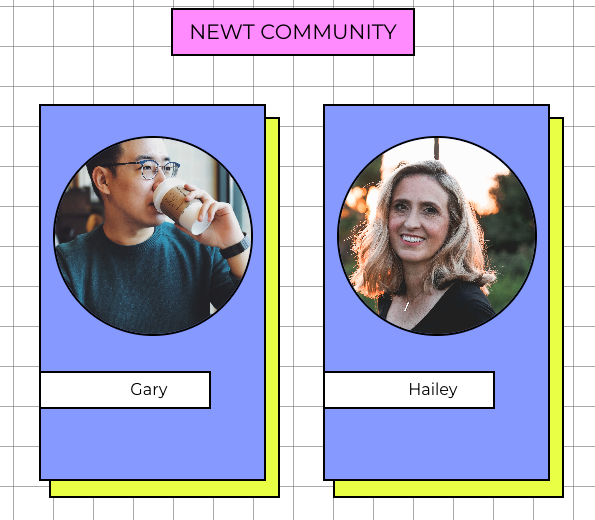
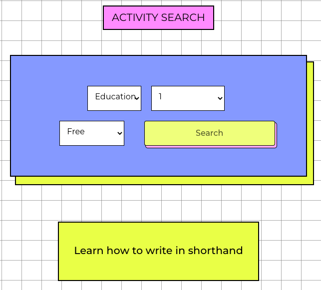
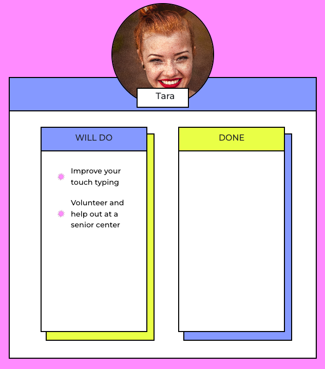

# Newt

#### A MERN Stack Application
_______
## Why Newt?

Objects at rest stay at rest- let's change that! This application will help users discover more about themselves, their peers, and their community by providing them with inspiring ideas to get up, get moving, and try something new.
_______
## Getting Started:
* [Check out the site!](https://newt-activity.netlify.app/)
* [Trello Board](https://trello.com/b/v9YnBlTX/newt-beryl-rachel-kevin)
* [Back End GitHub Repository](https://github.com/berylrb/newt-back-end)
_______
## Our Team:
**Beryl Baldwin: [GitHub](https://github.com/berylrb)**
 
**Rachel Kinzel: [GitHub](https://github.com/rharen11)**
 
**Kevin Rodriguez: [GitHub](https://github.com/UncleHagi)**
________
## What to look forward to:

_______
## Technologies Used
_______

 

 

## Credits
* [Bored API](http://www.boredapi.com/)
* [Hunter Long](https://github.com/whlong1)- CRUD implementation
* [David Stinson](https://github.com/DavidStinson)- API implementation
* [Ben Manley](https://github.com/ManliestBen)- API implementation
_______
## Ice Box
_______
* [x] Add comments for specific activities
* [x] User should see "add activity" button disappear on search page after adding to profile 
* [ ] Point system for activities completed
* [ ] Notes section for materials/supplies needed
* [ ] Route for exploring the specific categories of activities (type, price, etc.)
* [ ] User ability to move saved activities to a "done" list
* [ ] User ability to show a checked box on their profile if they are open to group activities
